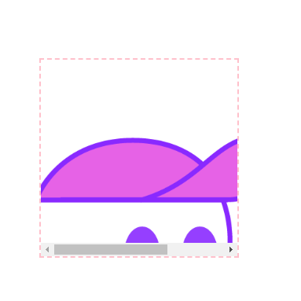
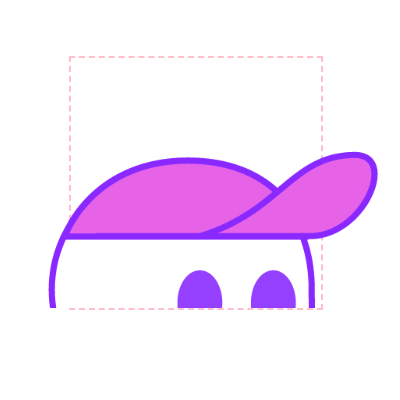

# overflow

## Overflow Clip

[原博客](https://ishadeed.com/article/overflow-clip/)

区别于 `hidden` 的地方就在于可以单独设置某一个方向的 `clip`

```html
<div class="card">
	<picture>
		
	</picture>
</div>
```

```css
.card {
	position: relative;
	width: 250px;
	height: 250px;
	border: 2px dashed pink;
}

.card img {
	position: absolute;
	top: 0;
	left: 50%;
	width: 500px;
	height: 500px;
	transform: translateX(-50%);
}
```

效果：

`overflow-y: hidden`



`overflow: clip`


